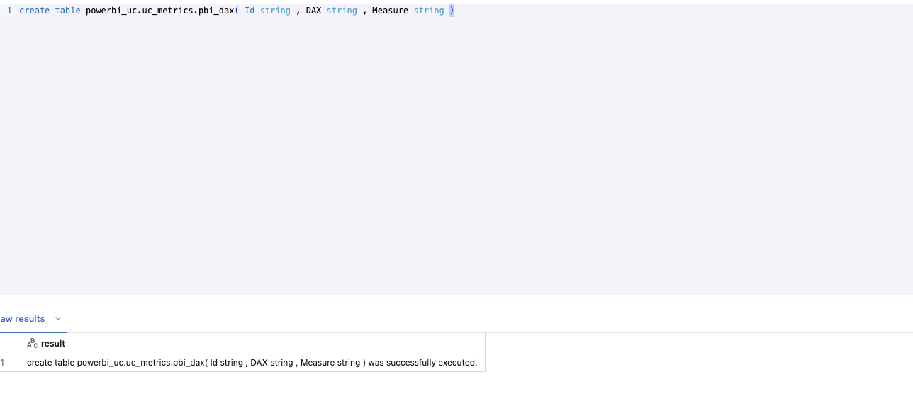
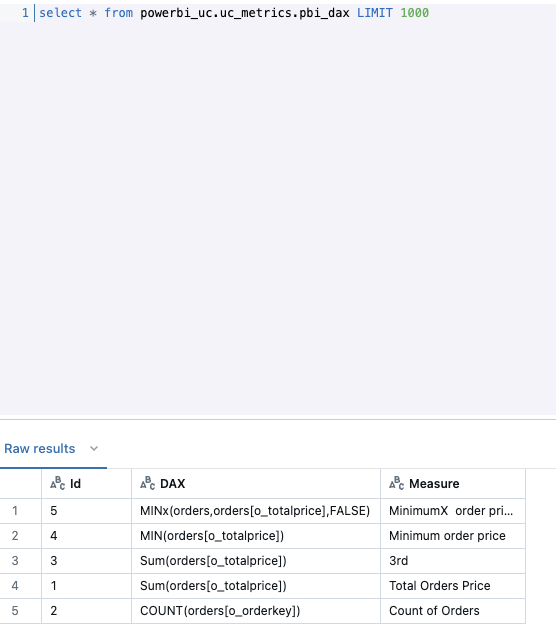
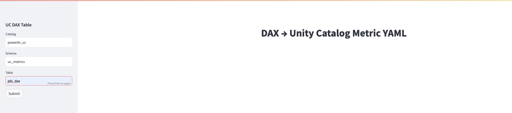
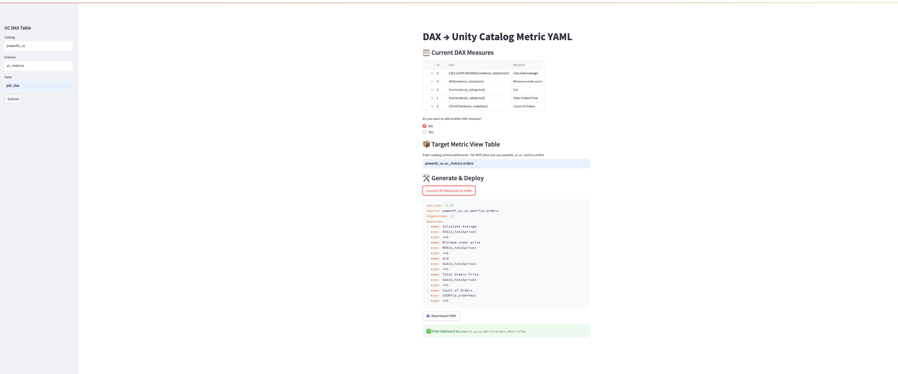
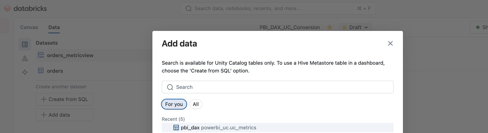
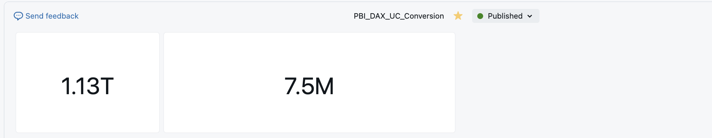

# PBI-DAX-to-UC-Metrics-Conversion App

This is a lightweight Databricks App which exposese the capabilities of UC Metrics. This project integrates with the Power BI DAX and converts the DAX measures such as Sum , Min , Max , Average , Calculate , Count, Filter into a UC Metrics View. These views can then be integrated with any Databricks features like AI / BI Dashboard , DBSQL , Genie , Alerting to showcase the End to End capabilities of DB platform . 

# Features

- View PBI DAX Measures in DB App.
- Enable Users to convert existing DAX measure to UC Metrics
- Enable Users to add more measures directly in the App
- Perform validation checks and log the errors. 
- Combine all measures into a UC metrics View YAML . Ability to download YAML to local machine
- Use the UC Metrics Views across DB Dashboards , Genie , SQL Queries etc.
  
# Prerequisites
-Databricks workspace with Databricks Apps Enabled.
-Power BI Premium and have a Power BI Report with DAX published.
-CAN USE permission on a Pro or Serverless SQL warehouse.
-Access to Unity Catalog .

# Step by Step Instructions  
1. Create a Power BI Report with basic measures like Sum , Min , Max , Average over a single Unity Catalog Table
2. Deploy the report in Power BI Service
3. Create a table in Databricks Unity Catalog . The table should have with three columns ( Id string , DAX string , Measure string )

4. Insert the Power BI measures in the table created above
   

5. Clone the Repository (if you haven't already)
6. Generate a PAT token in Databricks 
7. In the App.py , please enter your DBSQL connection string :  Host Name , Http Path . Also enter you PAT token for token variable
8. Create a Template Hello DB App and replace default App.py code and requirement.txt with files from repo.
9. In the app give the Catalog , Schema and Table Name of the table which has your DAX measure . Click Submit

10. The app will display all your DAX measures in the table. It would also prompt you if you want to add new DAX mesure. Select Yes or No. Under "Target Metrics View Name" give the name of the souce table from where you created the measures in Power BI . Click on "Convert All Measures to Yaml" . This will create a combined UC Metric View in your UC Schema and will also show you the view in the DB Apps

11. Create a AI/BI Dashboard by creating a data and Adding the above UC Metric View .

  
13.   You should be able to create a visual with the same measures as Power BI and they should match with Power BI Report

